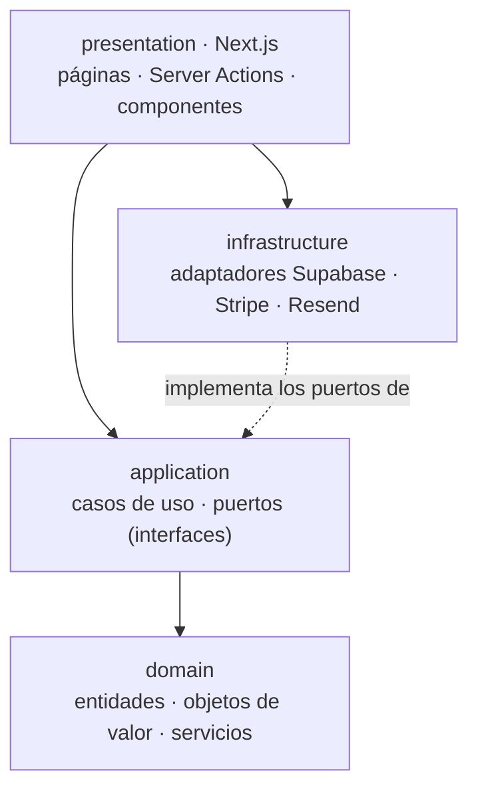

# Reservas Chanantes

**Plataforma SaaS *multi-tenant* de reserva de citas en línea para pequeños negocios de servicios.**

Cada negocio se registra como *tenant*, configura su catálogo de servicios y su horario de apertura, y publica una **URL pública propia** (p. ej. `/peluqueria-juan`) desde la que sus clientes consultan la disponibilidad en tiempo real, reservan una cita y, opcionalmente, pagan en línea. El modelo es **B2B2C**: la plataforma da servicio a los negocios y estos cobran a sus clientes finales mediante **Stripe Connect**.

🔗 **Demo en vivo:** <https://reservas-chanantes.vercel.app/>
📚 **Memoria académica (TFM):** [`docs/memoria/`](docs/memoria/) · **Presentación:** [HTML](docs/presentacion/index.html) · [PDF](docs/presentacion/Reservas-Chanantes-TFM-presentacion.pdf)

> Este repositorio es el entregable de un **Trabajo de Fin de Máster**. Más allá del producto, el proyecto es un **caso de estudio** sobre la viabilidad del desarrollo de software guiado por IA priorizando la máxima calidad de ingeniería (Arquitectura Limpia, DDD, TDD). El análisis completo está en la [memoria](docs/memoria/).

---

## Tabla de contenidos

- [¿Qué resuelve?](#qué-resuelve)
- [Probar la aplicación](#probar-la-aplicación)
- [Funcionalidades](#funcionalidades)
- [Arquitectura](#arquitectura)
- [Stack tecnológico](#stack-tecnológico)
- [Estructura del proyecto](#estructura-del-proyecto)
- [Puesta en marcha local](#puesta-en-marcha-local)
- [Despliegue](#despliegue)
- [Pruebas](#pruebas)
- [Estado y limitaciones](#estado-y-limitaciones)
- [Licencia](#licencia)

---

## ¿Qué resuelve?

Las microempresas de servicios con cita previa —peluquerías, fisioterapia, estética— suelen gestionar sus reservas por teléfono o mensajería, sin un sistema que evite solapamientos, calcule la disponibilidad de forma fiable o integre el cobro. Las soluciones comerciales resultan caras o demasiado genéricas para este perfil. Reservas Chanantes aporta una alternativa **ligera, de bajo coste operativo y arquitectónicamente sólida** que cubre el ciclo completo: configuración del negocio, página pública de reservas, cálculo de disponibilidad, pago en línea, portal del cliente y notificaciones por correo.

## Probar la aplicación

La aplicación está **desplegada y accesible** en <https://reservas-chanantes.vercel.app/>. Para una prueba de extremo a extremo:

1. **Crea un negocio** en [`/admin/register`](https://reservas-chanantes.vercel.app/admin/register) (correo y contraseña, o Google). Con correo, **confirma el email** que recibes para activar la cuenta.
2. Desde el panel, **añade uno o varios servicios** (nombre, duración, precio) y **define el horario semanal** de apertura.
3. En **Ajustes**, **conecta una cuenta de cobro** (Stripe Connect). El cobro está en **modo Test**, así que puedes completar el alta de Stripe con datos de prueba.
4. Anota el *slug* de tu negocio y visita su **página pública** `/[slug]`: verás el catálogo y la disponibilidad calculada en tiempo real.
5. Como cliente, **elige un hueco y reserva**. El hueco queda bloqueado de inmediato para el resto y se abre el pago.

> **Pago en modo Test:** el cobro usa **Stripe en modo de pruebas** (no se procesan pagos reales). Para completar una reserva, paga con la tarjeta de prueba **`4242 4242 4242 4242`**, cualquier fecha de caducidad futura y cualquier CVC. Una reserva solo puede completarse si el negocio tiene una cuenta de cobro de prueba conectada (paso 3).

> **Nota sobre el despliegue:** el servicio está activo (no se ha apagado para ahorrar costes). La base de datos se aloja en el plan gratuito de Supabase, que puede suspenderse tras un periodo de inactividad; en ese caso, la primera petición tras un periodo sin uso puede tardar unos segundos en responder («arranque en frío»).

## Funcionalidades

**Para el propietario del negocio (panel `/admin`)**
- Registro y autenticación por correo/contraseña o **Google OAuth**, con **confirmación de email** obligatoria (correos multiidioma) y recuperación de contraseña.
- Gestión de **servicios** (alta, edición, borrado: nombre, duración, precio, estado).
- Definición del **horario semanal** de apertura con varios rangos por día.
- Consulta y **cancelación de reservas** con verificación de propiedad.
- Configuración del negocio: **zona horaria**, política de antelación y perfil público.
- **Conexión de una cuenta de cobro** (Stripe Connect) para recibir pagos.
- **Método de cobro flexible**: pago en línea (Stripe), **pago presencial en el centro**, o ambos a la vez (no excluyentes).

**Para el cliente final (página pública `/[slug]` y portal `/my`)**
- Consulta de **disponibilidad en tiempo real** (horario menos reservas ocupadas).
- **Reserva** de una cita sobre un hueco disponible, con bloqueo inmediato del hueco.
- **Pago del servicio**: en línea (Stripe, confirmado mediante *webhook*) o **en el centro** al acudir, según lo que admita el negocio. Si admite ambos, el cliente elige.
- Registro/inicio de sesión como cliente y **vinculación de su historial** de reservas.
- **Portal de autoservicio**: historial, cancelación de sus propias reservas y edición de perfil.

**Sistema e integraciones**
- Correos de **confirmación** tras un pago satisfactorio (Resend).
- **Recordatorios automáticos** de reserva sin duplicados (*cron* + patrón *claim-and-release*).
- **Internacionalización** es-ES / en-US en el panel y en los correos.

## Arquitectura

El sistema aplica **Arquitectura Limpia** con cuatro capas y una regla central: **el dominio no depende de ningún *framework***. Esta propiedad es verificable en el código y es la que habilita una pirámide de pruebas de base ancha.



| Capa | Responsabilidad | Dependencias |
|------|-----------------|--------------|
| `domain` | Reglas de negocio puras: entidades, objetos de valor (con invariantes) y servicios de dominio (cálculo de disponibilidad, reloj por *tenant*, límites de plan). | **Ninguna** de *framework* |
| `application` | Casos de uso y **puertos** (interfaces de repositorio) que orquestan el dominio. | Solo `domain` |
| `infrastructure` | Adaptadores que **implementan los puertos**: Supabase (PostgreSQL/Auth), Stripe, Resend. | `application`, SDKs externos |
| `presentation` | Next.js (App Router): páginas, *Server Actions* y componentes. | Todas las anteriores |

Decisiones técnicas no triviales documentadas en la memoria: cálculo de disponibilidad como **aritmética entera de minutos**, prevención de solapamientos con una **restricción `EXCLUDE`/`btree_gist` de PostgreSQL** (integridad en la capa autoritativa), gestión **sensible a la zona horaria** del negocio e **idempotencia** de los recordatorios (*claim-and-release*). Detalle en [`docs/memoria/05-implementacion.md`](docs/memoria/05-implementacion.md).

## Stack tecnológico

| Categoría | Tecnología |
|-----------|------------|
| *Framework* | **Next.js 16** (App Router), **React 19**, **TypeScript** estricto |
| Base de datos y *auth* | **Supabase** — PostgreSQL + Auth + *Row Level Security* |
| Pagos | **Stripe Connect** (modelo B2B2C) |
| Correo transaccional | **Resend** |
| Estilos | **Tailwind CSS 4** |
| Pruebas | **Vitest** (320 casos en 45 ficheros) |
| Despliegue | **Vercel** (*serverless*) + *cron* programado |

## Estructura del proyecto

```
src/
  domain/                  Lógica de negocio pura
    entities/              Tenant, Service, Booking, Customer, WeeklySchedule
    value-objects/         TimeRange, Money, Slug, EmailAddress…
    services/              AvailabilityCalculator, tenant-clock, plan-limits
    errors/                Errores de dominio (p. ej. SlotTakenError)
  application/             Casos de uso y puertos
    use-cases/             GetAvailability, CreateBooking, ConnectStripeAccount…
    ports/                 Interfaces de repositorio
  infrastructure/          Adaptadores: supabase/ · stripe/ · resend/ · i18n/
  app/                     Next.js (App Router)
    admin/                 Panel del propietario (login, registro, dashboard)
    [slug]/                Página pública de reservas del negocio
    my/                    Portal del cliente final
    api/                   auth/callback · cron/send-reminders · stripe/* · webhooks/*
  proxy.ts                 Refresco de sesión y protección de rutas
supabase/
  migrations/              11 migraciones SQL (fuente de verdad del esquema)
docs/
  memoria/                 Memoria académica del TFM (7 capítulos + anexos)
  presentacion/            Diapositivas de la presentación (HTML)
```

## Puesta en marcha local

### Requisitos

- **Node.js 20.9+** (requerido por Next.js 16) y npm.
- Un proyecto de [**Supabase**](https://supabase.com) (gratuito).
- *(Opcional)* Cuentas de [Stripe](https://stripe.com) y [Resend](https://resend.com) para habilitar pagos y correos.

### 1. Clonar e instalar

```bash
git clone https://github.com/Ogires/reservas-chanantes.git
cd reservas-chanantes
npm install
```

### 2. Variables de entorno

Copia la plantilla y rellena los valores:

```bash
cp .env.local.example .env.local
```

| Variable | Necesaria para | Descripción |
|----------|----------------|-------------|
| `NEXT_PUBLIC_SUPABASE_URL` | **Arrancar** | URL del proyecto Supabase |
| `NEXT_PUBLIC_SUPABASE_ANON_KEY` | **Arrancar** | Clave anónima pública de Supabase |
| `SUPABASE_SERVICE_ROLE_KEY` | Operaciones de servidor | Clave de servicio privilegiada (*webhooks*, *cron*) |
| `STRIPE_SECRET_KEY` | Pagos | Clave secreta de Stripe (`sk_…`) |
| `STRIPE_WEBHOOK_SECRET` | Pagos | Firma del *webhook* `account.updated` |
| `STRIPE_CONNECT_WEBHOOK_SECRET` | Pagos | Firma del *webhook* `checkout.session.completed` |
| `RESEND_API_KEY` | Correos | Clave de API de Resend |
| `RESEND_FROM_DOMAIN` | Correos | Dominio remitente verificado (`reservas@…`) |
| `SUPABASE_AUTH_HOOK_SECRET` | Auth | Firma del *Send Email Hook* (correos de auth i18n) |
| `CRON_SECRET` | Recordatorios | Cadena aleatoria que protege el *endpoint* del *cron* |
| `NEXT_PUBLIC_SITE_URL` | URLs | URL pública del sitio (en local, `http://localhost:3000`) |
| `NEXT_PUBLIC_APP_URL` | Correos | URL base usada en las plantillas de correo |

> Para una primera ejecución basta con las dos variables de **Supabase**; el resto habilita pagos, correos y recordatorios. **No subas `.env.local` a Git** (está ignorado).

### 3. Base de datos

Aplica las migraciones con la CLI de Supabase (son la fuente de verdad del esquema):

```bash
npx supabase login
npx supabase link --project-ref TU_PROJECT_REF
npx supabase db push
```

En el panel de Supabase, ve a **Authentication → Providers → Email** y desactiva «Confirm email» para agilizar el desarrollo local.

### 4. Ejecutar

```bash
npm run dev      # servidor de desarrollo en http://localhost:3000
```

Otros *scripts* disponibles: `npm run build`, `npm start`, `npm run lint`.

## Despliegue

La aplicación está desplegada en **Vercel**. Para reproducir el despliegue:

1. Importa el repositorio en Vercel.
2. Configura las mismas variables de entorno en **Settings → Environment Variables**.
3. El archivo [`vercel.json`](vercel.json) registra un ***cron*** diario (`0 8 * * *`) que invoca `/api/cron/send-reminders` para enviar los recordatorios.
4. Configura los *webhooks* de Stripe (`/api/webhooks/stripe` y `/api/webhooks/stripe-connect`) apuntando al dominio de producción.

El despliegue a producción está **encadenado a la CI** (véase §6.7 de la memoria): el despliegue automático de Vercel por *git* está **desactivado** (Ignored Build Step → *Don't build anything*) y la publicación la realiza el *workflow* de GitHub Actions tras superar la puerta `quality`, empleando los *secrets* `VERCEL_TOKEN`, `VERCEL_ORG_ID` y `VERCEL_PROJECT_ID`.

**Panel de operador (`/superadmin`).** El operador de la plataforma dispone de un panel para gestionar los negocios cliente: métricas por negocio (reservas, clientes, volumen y comisión) y activación/desactivación. El acceso se restringe por lista blanca de correos en la variable `SUPERADMIN_EMAILS` (si está ausente, nadie tiene acceso).

## Pruebas

El proyecto se desarrolla con **TDD** en las capas de dominio y aplicación. La suite ejecuta **320 pruebas** (45 ficheros) con Vitest, con **umbral de cobertura** que hace de puerta de calidad, pruebas de **componente con Testing Library** y pruebas **E2E cross-browser con Playwright** (Chromium/Firefox/WebKit) del flujo de reserva:

```bash
npm test               # ejecuta toda la suite una vez
npm run test:watch     # modo interactivo
npm run test:coverage  # cobertura (falla por debajo del umbral)
npm run test:e2e       # E2E de Playwright (contra el despliegue)
```

Un flujo de **integración y despliegue continuos** (GitHub Actions, [`.github/workflows/ci.yml`](.github/workflows/ci.yml)) ejecuta `lint → tsc → tests+cobertura → build` (trabajo `quality`) en cada *push* y *pull request*. Si esa puerta pasa, un trabajo `deploy` **encadenado** (`needs: quality`) publica en producción con la CLI de Vercel, y los *pull requests* reciben una **vista previa**. Producción, por tanto, **solo se despliega con la CI en verde**.

## Estado y limitaciones

Este es el **MVP funcional** del sistema, desplegado y operativo. La memoria documenta con transparencia las limitaciones conocidas y las líneas futuras (ver [`docs/memoria/07-conclusiones.md`](docs/memoria/07-conclusiones.md)). Se ha aplicado un **paquete de endurecimiento de seguridad OWASP** (detalle en el [Anexo E de la memoria](docs/memoria/09-anexos.md)): RLS acotada a **propietario y titular** —cerrando la exposición de PII—, **cabeceras de seguridad y CSP**, **política de contraseñas fuerte**, **validación del entorno con Zod**, **limitación de tasa** y **registro estructurado de eventos de seguridad**. Las limitaciones que restan son: monetización por plan diseñada pero no activada, una desviación arquitectónica acotada en la rama de administración, y la ausencia de pruebas de integración contra una base de datos real (la CI, la cobertura con umbral y las pruebas E2E ya están operativas). Estas brechas no comprometen el funcionamiento del producto en su alcance de MVP y se reconocen explícitamente como parte del objetivo metodológico del trabajo.

## Licencia

MIT
