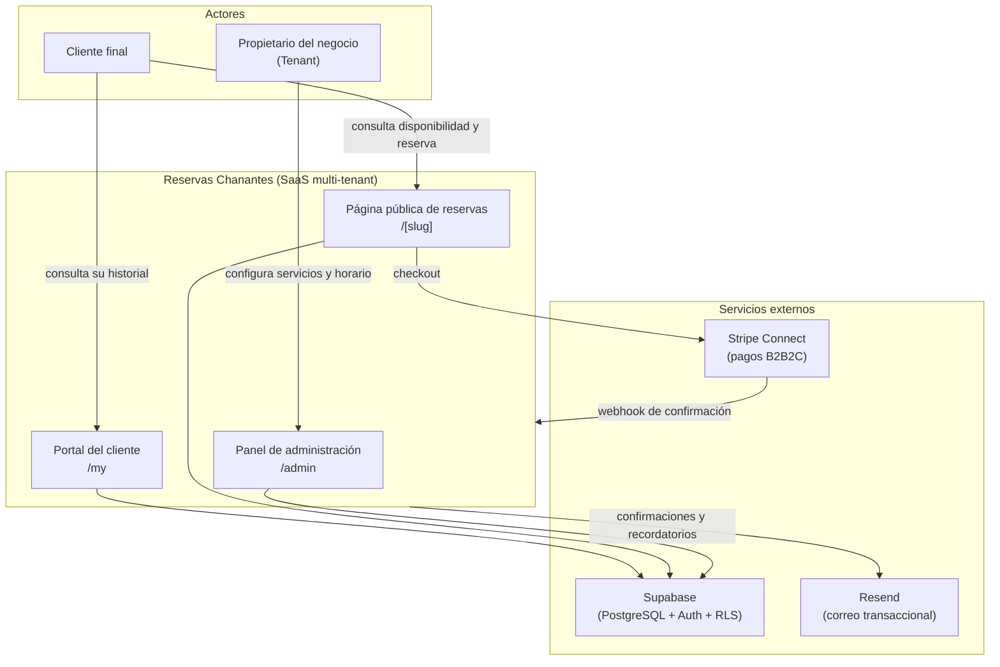

# Capítulo 1. Introducción y Objetivos

## 1.1. Contexto

El presente Trabajo de Fin de Máster documenta el diseño y la implementación de **Reservas Chanantes**, una **plataforma SaaS (*Software as a Service*) multi-tenant de reserva de citas en línea** orientada a pequeños negocios de servicios con cita previa —peluquerías, centros de fisioterapia, estética y similares—. El sistema permite que un negocio se registre como **inquilino (*tenant*)**, configure su catálogo de servicios y su horario de apertura, y publique una **URL pública propia** (por ejemplo, `/peluqueria-juan`) desde la que sus clientes finales consultan la disponibilidad en tiempo real, reservan una cita y, opcionalmente, abonan el servicio en línea.

La aplicación responde a una necesidad real del segmento de microempresas y autónomos, que con frecuencia gestionan sus citas por teléfono o mensajería instantánea, sin un sistema que evite solapamientos, calcule la disponibilidad de forma fiable o integre el cobro. Las soluciones comerciales existentes suelen resultar costosas o excesivamente genéricas para este perfil, lo que justifica el desarrollo de una alternativa **ligera, de bajo coste operativo y arquitectónicamente sólida**.

Desde el punto de vista del modelo de negocio, el sistema adopta un esquema **B2B2C** (*business-to-business-to-consumer*): la plataforma presta servicio a los negocios (B2B) y estos, a su vez, atienden a sus propios clientes finales (B2C). Esta naturaleza se refleja directamente en la integración de pagos mediante **Stripe Connect**, que habilita que cada negocio cobre a sus clientes a través de la plataforma reteniendo esta una comisión.

> *Figura 1.1. Diagrama de contexto del sistema: actores principales, superficies de la aplicación y servicios externos integrados.*

## 1.2. Justificación

La motivación del proyecto es doble y combina una dimensión **funcional** y otra **metodológica**, siendo esta última el verdadero eje vertebrador del Trabajo de Fin de Máster.

- **Justificación funcional.** Se busca cubrir la carencia descrita aportando un producto que resuelva los problemas técnicamente no triviales del dominio: el **cálculo de disponibilidad** a partir del horario de apertura menos las reservas ya ocupadas, la **prevención de reservas solapadas** ante accesos concurrentes, la **gestión horaria sensible a la zona horaria** del negocio y la **integración de pagos** en un contexto multi-negocio.

- **Justificación metodológica.** Tal como se recoge en el documento de diseño original del proyecto, el objetivo fundamental es **demostrar la viabilidad del desarrollo de software guiado por Inteligencia Artificial priorizando la máxima calidad** (`docs/plans/2026-02-20-booking-saas-design.md`). El proyecto se concibe, por tanto, no solo como un producto, sino como un **caso de estudio** sobre la aplicación rigurosa de principios de ingeniería del software —**Arquitectura Limpia (*Clean Architecture*)**, **diseño dirigido por el dominio (*Domain-Driven Design*)**, **desarrollo guiado por pruebas (*Test-Driven Development*)** y principios **SOLID**— en un flujo de trabajo asistido por IA. La trazabilidad de este proceso queda documentada en los artefactos del repositorio (`docs/plans/`, `docs/reviews/` y `docs/plans/2026-02-20-mvp-deviations.md`).

## 1.3. Objetivos

### 1.3.1. Objetivo general

Diseñar, implementar y desplegar una plataforma SaaS multi-tenant de reservas en línea de calidad de producción, que sirva simultáneamente como **validación empírica de un proceso de desarrollo asistido por IA centrado en la calidad del software**, evidenciada mediante una arquitectura desacoplada y una cobertura de pruebas sistemática.

### 1.3.2. Objetivos específicos (técnicos)

Se identifican los siguientes objetivos específicos, todos ellos verificables sobre el código del repositorio:

1. **Aplicar Arquitectura Limpia** con separación estricta de capas (`domain`, `application`, `infrastructure`, `presentation`), manteniendo el dominio libre de dependencias de *framework*.
2. **Modelar el dominio** mediante entidades, objetos de valor (*value objects*) y servicios de dominio puros que encapsulen las reglas de negocio (cálculo de disponibilidad, políticas de antelación, validaciones).
3. **Garantizar la integridad de las reservas** frente a la concurrencia, llevando la prevención de solapamientos a la capa autoritativa de la base de datos.
4. **Implementar la multi-tenancy** con aislamiento de datos mediante *Row Level Security* (RLS) de PostgreSQL.
5. **Integrar pagos B2B2C** con Stripe Connect, incluyendo el alta de cuentas conectadas y la confirmación de reservas mediante *webhooks*.
6. **Ofrecer una experiencia internacionalizada** (es-ES / en-US) tanto en el panel de administración como en las comunicaciones por correo electrónico.
7. **Desplegar el sistema** en un entorno *serverless* de ejecución continua.

### 1.3.3. Objetivos metodológicos (de calidad)

1. **Adoptar TDD** como práctica de desarrollo en las capas de dominio y aplicación, sustentando el código en una batería de pruebas automatizadas.
2. **Mantener la trazabilidad del proceso** asistido por IA mediante planes de implementación, documentos de revisión y registro de desviaciones.
3. **Documentar de forma honesta las limitaciones** del sistema, distinguiendo lo implementado de lo planificado como trabajo futuro.

## 1.4. Alcance

El alcance del Trabajo de Fin de Máster comprende el **producto mínimo viable funcional** del sistema: registro y autenticación de negocios, gestión de servicios y horarios, página pública de reservas con cálculo de disponibilidad, flujo de pago con Stripe, portal del cliente final y sistema de notificaciones por correo. Quedan **explícitamente fuera del alcance** de la presente entrega, y se abordan como líneas futuras (Capítulo 7), la automatización de la integración continua (CI/CD), las pruebas *end-to-end* automatizadas y el endurecimiento de determinadas políticas de seguridad, según se detalla en el análisis de brechas del proyecto.

## 1.5. Estructura del documento

La memoria se organiza en siete capítulos. Tras esta **introducción** (Capítulo 1), el **Capítulo 2** justifica la pila tecnológica frente a sus alternativas. El **Capítulo 3** formaliza los requisitos y casos de uso. El **Capítulo 4** detalla el diseño y la arquitectura del sistema. El **Capítulo 5** profundiza en los aspectos más relevantes de la implementación. El **Capítulo 6** describe la estrategia de pruebas y control de calidad. Finalmente, el **Capítulo 7** valora el grado de cumplimiento de los objetivos y propone líneas de evolución futura.

---

[🏠 Índice](README.md) · [Capítulo 2. Estado del Arte y Tecnologías ▶](02-estado-del-arte.md)
