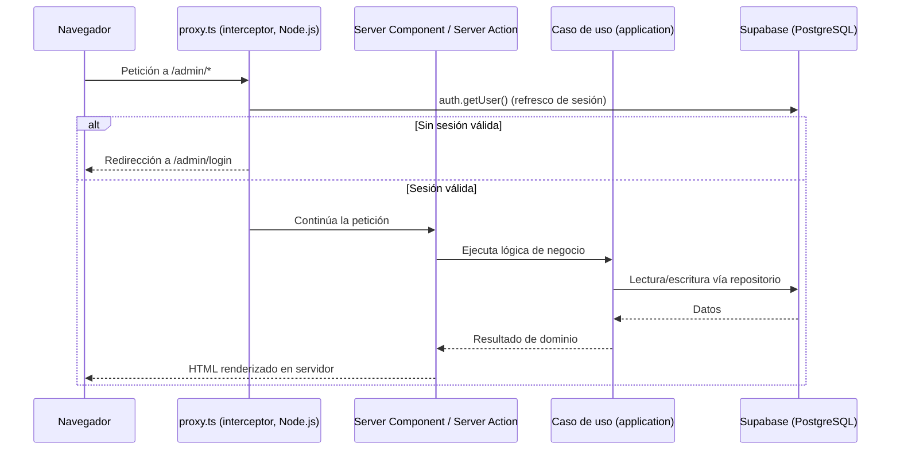

# Capítulo 2. Estado del Arte y Tecnologías

## 2.1. Panorama de las soluciones de reserva en línea

El mercado de la reserva de citas en línea está ocupado por plataformas comerciales propietarias de tipo SaaS —entre las más extendidas, Calendly, Booksy o Treatwell— que ofrecen una funcionalidad amplia a cambio de cuotas periódicas y de un grado de personalización limitado. Para el segmento objetivo de este trabajo (microempresas y profesionales autónomos), dichas soluciones presentan dos inconvenientes recurrentes: un **coste recurrente** difícil de sostener y un modelo de explotación cerrado en el que el negocio no controla plenamente ni sus datos ni su identidad digital.

Frente a este panorama, el sistema desarrollado se plantea como una alternativa **autoalojable y de bajo coste operativo**, sustentada en servicios gestionados con planes de entrada gratuitos. La aportación diferencial del proyecto no reside en el volumen de funcionalidades, sino en el rigor arquitectónico y en la dimensión metodológica expuestos en el Capítulo 1.

## 2.2. Marco conceptual

La fundamentación teórica del proyecto se apoya en un conjunto de principios consolidados de la ingeniería del software, que constituyen el verdadero estado del arte sobre el que se construye la solución:

- **Arquitectura Limpia (*Clean Architecture*)**: propone organizar el software en capas concéntricas en las que las dependencias apuntan siempre hacia el dominio, de modo que las reglas de negocio permanezcan independientes de los detalles de entrega y de infraestructura [1].
- **Diseño dirigido por el dominio (*Domain-Driven Design*)**: aporta el vocabulario de modelado —entidades, objetos de valor y servicios de dominio— empleado en la capa central del sistema [2].
- **Arquitectura hexagonal (*Ports and Adapters*)**: formaliza el desacoplamiento entre la lógica de aplicación y sus dependencias externas mediante puertos (interfaces) y adaptadores (implementaciones) [3].
- **Patrón Repositorio**: media entre el dominio y la capa de persistencia ofreciendo una interfaz de tipo colección para el acceso a los objetos de dominio [4].
- **Desarrollo guiado por pruebas (*Test-Driven Development*)**: establece el ciclo de escritura de pruebas previas a la implementación que vertebra el desarrollo de las capas de dominio y aplicación [5].
- **Multi-tenancy en aplicaciones SaaS**: define el alojamiento de múltiples clientes (*tenants*) sobre una única instancia de aplicación, junto con las preocupaciones arquitectónicas asociadas —aislamiento de datos, personalización y rendimiento— [6].

Estos principios no son meramente declarativos: su materialización es verificable en la estructura del repositorio y se detalla en el Capítulo 4.

A este marco de principios de ingeniería, el trabajo añade un **paradigma de proceso** que constituye su objeto de estudio: el **desarrollo de software asistido por IA**. Los grandes modelos de lenguaje entrenados sobre código —evaluados de forma sistemática desde Codex por Chen *et al.* [18]— y su integración en asistentes de editor han demostrado mejoras de productividad medibles; el estudio controlado de Peng *et al.* sobre GitHub Copilot cifra en torno a un **55 %** la reducción del tiempo en una tarea de programación acotada [19]. Sin embargo, la evidencia empírica señala también su riesgo característico: la generación de código **plausible pero defectuoso o inseguro**. Pearce *et al.* hallaron que una fracción sustancial del código sugerido por Copilot en escenarios sensibles a la seguridad contenía vulnerabilidades [20]. Este Trabajo se sitúa precisamente en esa tensión: no cuestiona la capacidad *generativa* de la IA, sino que investiga qué **disciplina de ingeniería** —arquitectura estricta, TDD, revisión adversarial— la convierte en software fiable. Ese desarrollo metodológico es el contenido del Capítulo 7.

## 2.3. Criterios de selección tecnológica

La elección de la pila se rige por cuatro criterios derivados de los objetivos del proyecto:

1. **Coherencia con la Arquitectura Limpia**: el *framework* no debe imponer acoplamientos que penetren en el dominio.
2. **Verificabilidad**: las herramientas deben favorecer un ciclo de TDD ágil.
3. **Seguridad de tipos**: se prioriza la detección de errores en tiempo de compilación.
4. **Coste y operación**: se favorecen modelos *serverless* y servicios gestionados que minimicen la administración de infraestructura.

## 2.4. Lenguaje de programación: TypeScript en modo estricto

Se ha optado por **TypeScript** (`typescript ^5`) frente a JavaScript como lenguaje base. El proyecto activa el **modo estricto** del compilador (`"strict": true` en `tsconfig.json`), que habilita de forma conjunta un grupo de comprobaciones —entre ellas `strictNullChecks` y `noImplicitAny`—, reforzando el criterio de seguridad de tipos. Esta garantía resulta especialmente valiosa en la capa de dominio, donde los objetos de valor (por ejemplo, `Money` o `TimeRange`) dependen de invariantes que el sistema de tipos contribuye a preservar. La configuración define además un **alias de módulos** (`"@/*": ["./src/*"]`) que habilita importaciones absolutas y clarifica las dependencias entre capas.

## 2.5. Framework de aplicación: Next.js 16 (App Router)

El núcleo de la aplicación se construye sobre **Next.js 16.1.6** con **React 19.2**, empleando el paradigma **App Router**. La elección se sustenta en tres capacidades que el repositorio utiliza de forma directa:

- **React Server Components (RSC)**: componentes que se renderizan en el servidor, en un entorno separado del cliente, lo que reduce el JavaScript enviado al navegador y permite el acceso a la infraestructura sin exponer secretos [7]. Los RSC alcanzaron estabilidad en React 19; según la documentación oficial de React, el App Router de Next.js constituye la implementación de RSC más madura y lista para producción disponible en la actualidad [7].
- **Server Actions**: la mutación de datos se canaliza a través de funciones de servidor —el repositorio contiene **diez** ficheros `actions.ts` en `src/app/**`— que actúan como **controladores** en términos de la Arquitectura Limpia, delegando en los casos de uso de la capa de aplicación.
- **Interceptación de peticiones**: la gestión transversal de la sesión y la protección de rutas se implementa en `src/proxy.ts`. Conviene precisar que en Next.js 16 el fichero `proxy` **sustituye al anterior convenio `middleware`** y se ejecuta, por defecto, en el entorno de ejecución **Node.js**. Este interceptor refresca la sesión y protege las rutas `/admin` (salvo `login` y `register`) y `/my` (salvo `login`).

> *Figura 2.1. Modelo de ejecución SSR con interceptación de sesión (`src/proxy.ts`) y delegación en los casos de uso.*

Respecto a las alternativas, la siguiente tabla resume la comparación frente a los principales candidatos:

| Criterio | Next.js (App Router) | SPA (React + Express) | Remix | Nuxt |
|----------|----------------------|------------------------|-------|------|
| Ecosistema base | React | React | React | **Vue** (no React) |
| React Server Components | Sí, estables | No | Parcial / en desarrollo | No aplica |
| Tipado extremo a extremo | Nativo | Requiere duplicación | Nativo | Nativo (Vue) |
| Despliegue *serverless* | Integrado | Manual | Integrado | Integrado |

> *Tabla 2.1. Comparativa del framework de aplicación frente a alternativas.*

Una arquitectura tradicional de **SPA con API REST en Express** habría exigido duplicar la definición de tipos entre cliente y servidor y gestionar manualmente la serialización y la autenticación. **Remix** ofrece capacidades SSR comparables sobre React, si bien su soporte de RSC se encontraba en desarrollo en el momento de la elección. **Nuxt**, por su parte, pertenece al ecosistema **Vue**, lo que lo descartaba para un proyecto basado en React. Next.js se seleccionó por integrar de forma estable los RSC, los *Server Actions* y el despliegue *serverless*.

## 2.6. Persistencia y autenticación: Supabase

La persistencia y la autenticación se delegan en **Supabase** (`@supabase/supabase-js ^2.97`, `@supabase/ssr ^0.8`), una plataforma gestionada que expone **PostgreSQL** como base de datos relacional junto con servicios de autenticación y de seguridad a nivel de fila (*Row Level Security*, RLS). La integración se materializa en tres clientes diferenciados:

- **Cliente de navegador** (`createSupabaseBrowser`, en `client.ts`), para componentes de cliente.
- **Cliente de servidor** (`createSupabaseServer`, en `server.ts`), que sincroniza la sesión mediante *cookies* a través de `next/headers`.
- **Cliente administrativo** (`createSupabaseAdmin`, en `admin-client.ts`), con privilegios elevados para operaciones de confianza, como la confirmación de reservas desde los *webhooks*.

El factor decisivo es el motor relacional: características avanzadas empleadas en el Capítulo 5 —como los rangos (`int4range`) y las **restricciones de exclusión** con `btree_gist` para impedir solapamientos— solo están disponibles en un sistema como PostgreSQL.

| Criterio | Supabase (PostgreSQL) | Firebase (Firestore) | Backend propio |
|----------|-----------------------|----------------------|----------------|
| Modelo de datos | Relacional (SQL) | Documental (NoSQL) | Variable |
| Integridad referencial | Nativa (claves foráneas, *checks*) | Limitada | Manual |
| Restricciones de exclusión / rangos | Sí (`EXCLUDE`, `btree_gist`) | No disponible | Compleja |
| Seguridad a nivel de fila | RLS declarativa | Reglas propietarias | A implementar |
| Operación | Gestionada | Gestionada | Autogestionada |

> *Tabla 2.2. Comparativa de la capa de persistencia frente a alternativas.*

Se descartó **Firebase** porque su modelo documental no permite expresar las **restricciones de exclusión relacionales** que el dominio exige para prevenir solapamientos de reservas, además de dificultar la integridad referencial entre `tenants`, `services` y `bookings`. Un **backend propio** habría incrementado el coste operativo sin aportar ventajas funcionales dentro del alcance definido.

Conviene matizar, en aras del rigor, que el uso de RLS no equivale por sí solo a un aislamiento estricto entre *tenants*: las políticas del **esquema inicial** eran deliberadamente permisivas en las tablas `bookings` y `customers` (acceso público de lectura e inserción). Esa limitación se **subsanó** con el paquete de endurecimiento OWASP (Capítulo 5 §5.7 y Anexo E), acotando el acceso a **propietario y titular**; los flujos anónimos legítimos se reenrutan al cliente de *service-role* en el servidor.

## 2.7. Pasarela de pagos: Stripe y Stripe Connect

El cobro se implementa con **Stripe** (`stripe ^20.3`) a través de su SDK oficial, instanciado de forma perezosa como *singleton* en `src/infrastructure/stripe/client.ts`. La naturaleza **B2B2C** del producto motiva el uso específico de **Stripe Connect**, que permite a la plataforma orquestar pagos en nombre de cuentas de terceros (los negocios) reteniendo una comisión. La verificación de las notificaciones se realiza mediante la firma de los *webhooks* en `src/app/api/webhooks/**`.

| Criterio | Stripe Connect | Adyen for Platforms | PayPal | Redsys |
|----------|----------------|---------------------|--------|--------|
| Modelo de *marketplace* (cuentas conectadas) | Nativo | Nativo | Limitado | No nativo |
| Orientación | Pymes y plataformas | Gran empresa | Generalista | Banca (España) |
| Experiencia de desarrollo / API | Amplia y documentada | Orientada a integración empresarial | Heterogénea | Centrada en TPV/banca |
| Barrera de entrada para pequeños negocios | Baja | Alta | Media | Media-alta |

> *Tabla 2.3. Comparativa de pasarelas de pago para un modelo B2B2C.*

**Adyen** ofrece un modelo de plataforma técnicamente equiparable, si bien está orientado a clientes de gran tamaño. **PayPal** dispone de soluciones de *marketplace*, aunque su modelo de pagos divididos resulta menos homogéneo para integraciones de pequeña escala. **Redsys**, ampliamente implantado en España, se orienta al procesamiento de tarjetas de un único comercio y no contempla de forma nativa el reparto de pagos entre múltiples partes. Stripe Connect se seleccionó por combinar un modelo de *marketplace* nativo con una baja barrera de entrada y una experiencia de desarrollo adecuada al alcance del proyecto.

## 2.8. Correo transaccional: Resend

Las comunicaciones (confirmaciones y recordatorios de reserva) se envían mediante **Resend** (`resend ^6.9`). La capa de infraestructura (`src/infrastructure/resend/`) encapsula la composición de plantillas, su traducción (es-ES / en-US) y el formateo de fechas, manteniendo el envío detrás de un puerto de la capa de aplicación (`notification-service.ts`). Esta abstracción permite sustituir el proveedor (por ejemplo, por SendGrid o Amazon SES) sin alterar la lógica de negocio. Cabe señalar que la implementación actual registra los fallos de envío sin propagarlos al flujo principal, decisión cuyo endurecimiento se contempla entre las líneas futuras.

## 2.9. Interfaz de usuario: Tailwind CSS 4

La capa de presentación utiliza **Tailwind CSS 4**, un *framework* de utilidades CSS integrado de forma nativa con el motor de PostCSS de Next.js (`@tailwindcss/postcss`). Su modelo *utility-first* favorece la consistencia visual y evita la proliferación de hojas de estilo ad hoc.

## 2.10. Pruebas: Vitest

El marco de pruebas es **Vitest 4** (`vitest ^4.0.18`), configurado con `vite-tsconfig-paths` y `@vitejs/plugin-react`. Se seleccionó frente a **Jest** atendiendo a dos criterios objetivos del proyecto: su compatibilidad nativa con módulos ESM y TypeScript —que evita la capa de transpilación adicional que Jest requiere— y su integración directa con la cadena de herramientas de Vite empleada en el resto del entorno. Esta elección sostiene el ciclo de TDD descrito en el Capítulo 6.

## 2.11. Síntesis de la pila tecnológica

| Capa | Tecnología | Versión | Justificación principal |
|------|-----------|---------|--------------------------|
| Lenguaje | TypeScript (strict) | `^5` | Seguridad de tipos en el dominio |
| Framework | Next.js (App Router) | `16.1.6` | RSC, *Server Actions* y SSR |
| Vista | React | `19.2.3` | Componentes de servidor y cliente |
| Estilos | Tailwind CSS | `^4` | Diseño *utility-first* consistente |
| Datos / Auth | Supabase (PostgreSQL) | `ssr ^0.8` / `js ^2.97` | RLS y restricciones de concurrencia |
| Pagos | Stripe Connect | `^20.3` | Modelo de *marketplace* B2B2C |
| Correo | Resend | `^6.9` | API transaccional desacoplable |
| Pruebas | Vitest | `^4.0.18` | TDD nativo en ESM/TS |

> *Tabla 2.4. Resumen de la pila tecnológica y su justificación.*

En conjunto, la pila satisface los cuatro criterios de la sección 2.3: habilita una arquitectura desacoplada, favorece la verificabilidad, maximiza la seguridad de tipos y se apoya en servicios gestionados de bajo coste operativo.

## Referencias del capítulo

[1] R. C. Martin, *Clean Architecture: A Craftsman's Guide to Software Structure and Design*. Boston, MA, USA: Prentice Hall, 2017.

[2] E. Evans, *Domain-Driven Design: Tackling Complexity in the Heart of Software*. Boston, MA, USA: Addison-Wesley, 2003.

[3] A. Cockburn, "Hexagonal Architecture (Ports and Adapters)," 2005. [En línea]. Disponible: https://alistair.cockburn.us/hexagonal-architecture/

[4] M. Fowler, *Patterns of Enterprise Application Architecture*. Boston, MA, USA: Addison-Wesley, 2002.

[5] K. Beck, *Test-Driven Development: By Example*. Boston, MA, USA: Addison-Wesley, 2002.

[6] R. Krebs, C. Momm y S. Kounev, "Architectural Concerns in Multi-Tenant SaaS Applications," en *Proc. 2nd Int. Conf. on Cloud Computing and Services Science (CLOSER 2012)*, SciTePress, 2012, pp. 426–431.

[7] React Team, "Server Components," *React Documentation*. [En línea]. Disponible: https://react.dev/reference/rsc/server-components

> Las referencias citadas (`[1]`–`[7]`) se recogen también en la **[Bibliografía](09-bibliografia.md)** consolidada de la memoria.

---

[◀ Capítulo 1. Introducción y Objetivos](01-introduccion.md) · [🏠 Índice](README.md) · [Capítulo 3. Análisis de Requisitos y Casos de Uso ▶](03-requisitos-casos-uso.md)
