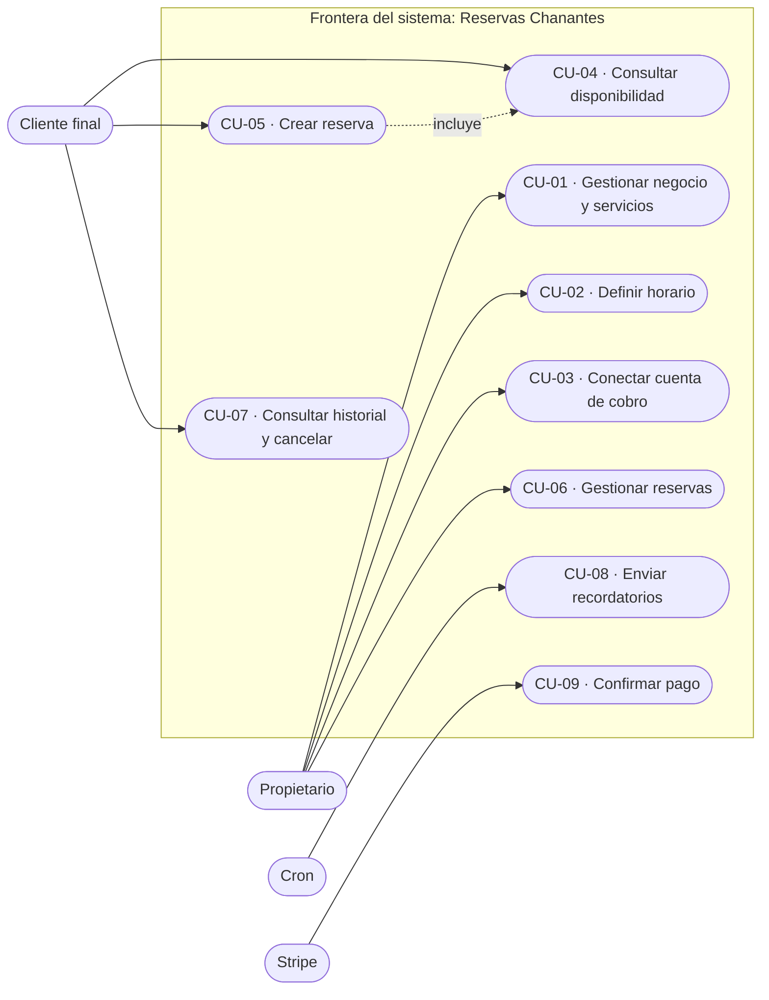

# Capítulo 3. Análisis de Requisitos y Casos de Uso

## 3.1. Introducción

Este capítulo formaliza los requisitos del sistema y modela su comportamiento mediante casos de uso. El análisis se ha realizado por **ingeniería inversa sobre el código existente**, de modo que cada requisito es trazable hasta su implementación concreta en el repositorio. Se distinguen los **requisitos funcionales** (qué debe hacer el sistema), los **requisitos no funcionales** (con qué cualidades) y la especificación de los casos de uso más representativos.

## 3.2. Actores del sistema

Se identifican cuatro actores, dos humanos y dos no humanos:

| Actor | Tipo | Descripción |
|-------|------|-------------|
| **Propietario del negocio** | Humano | Usuario registrado (*tenant*) que configura el negocio, sus servicios y su horario, y gestiona las reservas recibidas. Opera en `/admin`. |
| **Cliente final** | Humano | Persona que reserva una cita. Puede actuar de forma **anónima** (página pública `/[slug]`) o **autenticada** (portal `/my`). |
| **Sistema de tareas programadas** | No humano | Proceso automático (*cron*) que dispara el envío de recordatorios de reserva (`/api/cron/send-reminders`). |
| **Pasarela de pago (Stripe)** | No humano | Sistema externo que confirma los pagos y el estado de las cuentas conectadas mediante *webhooks* (`/api/webhooks/**`). |

El proveedor de identidad Google no se modela como actor independiente, sino como mecanismo de autenticación del actor humano a través de Supabase Auth.

## 3.3. Requisitos funcionales

Los requisitos funcionales se agrupan por actor. La columna *Implementación* aporta la trazabilidad exigida (regla de verificación frente al código).

### 3.3.1. Propietario del negocio (RF-A)

| ID | Requisito | Implementación |
|----|-----------|----------------|
| RF-A1 | Registrar un negocio y crear su cuenta de propietario | `admin/register/actions.ts` (`register`) |
| RF-A2 | Autenticarse mediante correo/contraseña o Google OAuth; el registro por correo exige **confirmación de email** | `admin/login/actions.ts` (`login`); `signInWithOAuth`; `api/auth/callback` (OAuth) y `api/auth/confirm` (confirmación por enlace) |
| RF-A3 | Recuperar la contraseña olvidada | `admin/login/actions.ts` (`resetPassword`) y página `admin/reset-password/` (`updatePassword`) |
| RF-A4 | Crear, editar y eliminar servicios (nombre, duración, precio, estado) | `admin/(dashboard)/services/actions.ts` (`saveService`, `deleteService`) |
| RF-A5 | Definir el horario semanal de apertura (varios rangos por día) | `admin/(dashboard)/schedule/actions.ts` (`saveSchedule`) |
| RF-A6 | Consultar y cancelar reservas, con verificación de propiedad | `admin/(dashboard)/bookings/actions.ts` (`cancelBooking`) |
| RF-A7 | Configurar el negocio: zona horaria, política de antelación y perfil | `admin/(dashboard)/settings/actions.ts` (`saveSettings`) |
| RF-A8 | Conectar una cuenta de cobro para recibir pagos | `application/use-cases/connect-stripe-account.ts`; `api/stripe/connect` |

### 3.3.2. Cliente final (RF-C)

| ID | Requisito | Implementación |
|----|-----------|----------------|
| RF-C1 | Consultar la disponibilidad de un negocio en tiempo real | `[slug]/actions.ts` (`getAvailability`); `application/use-cases/get-availability.ts` |
| RF-C2 | Crear una reserva sobre un hueco disponible | `[slug]/actions.ts` (`createBooking`); `application/use-cases/create-booking.ts` |
| RF-C3 | Pagar el servicio en línea | `infrastructure/stripe/payment-service.ts` (`createCheckoutSession`); confirmación vía *webhook* |
| RF-C4 | Registrarse e iniciar sesión como cliente | `my/login/actions.ts` (`customerRegister`, `customerLogin`) |
| RF-C5 | Vincular la cuenta autenticada con su historial de reservas | `application/use-cases/link-customer-auth.ts` |
| RF-C6 | Consultar su historial de reservas | `application/use-cases/get-customer-bookings.ts`; `my/(portal)/history` |
| RF-C7 | Cancelar una de sus reservas (autoservicio) | `my/(portal)/actions.ts` (`cancelCustomerBooking`); `application/use-cases/cancel-customer-booking.ts` |
| RF-C8 | Actualizar los datos de su perfil | `my/(portal)/profile/actions.ts` (`updateProfile`); `application/use-cases/update-customer-profile.ts` |

### 3.3.3. Sistema e integraciones (RF-S)

| ID | Requisito | Implementación |
|----|-----------|----------------|
| RF-S1 | Enviar correos de confirmación tras un pago satisfactorio | `infrastructure/resend/send-booking-emails.ts`; *webhook* `stripe-connect` |
| RF-S2 | Enviar recordatorios automáticos de reserva, sin duplicados | `api/cron/send-reminders/route.ts` (patrón *claim-and-release*) |
| RF-S3 | Confirmar la reserva al completarse el pago | `api/webhooks/stripe-connect/route.ts` (`checkout.session.completed`) |
| RF-S4 | Actualizar el estado de la cuenta de cobro del negocio | `api/webhooks/stripe/route.ts` (`account.updated`) |

El sistema cuenta, por tanto, con **20 requisitos funcionales** (8 del propietario, 8 del cliente y 4 del sistema).

## 3.4. Requisitos no funcionales

| ID | Categoría | Requisito | Sustento en el sistema |
|----|-----------|-----------|------------------------|
| RNF-1 | Seguridad | Autenticación de usuarios y protección de rutas privadas | Supabase Auth; interceptor `src/proxy.ts` |
| RNF-2 | Seguridad | Verificación de la autenticidad de las notificaciones de pago | Firma de *webhooks* (`constructEvent`) |
| RNF-3 | Integridad | Imposibilidad de reservas solapadas ante concurrencia | Restricción `EXCLUDE`/`btree_gist` sobre `int4range(start_minutes, end_minutes, '[)')` (excluyendo reservas canceladas) en PostgreSQL |
| RNF-4 | Internacionalización | Interfaz y correos en es-ES y en-US | `infrastructure/i18n/`, `infrastructure/resend/` |
| RNF-5 | Mantenibilidad | Separación estricta de capas y dominio independiente | Arquitectura Limpia (Capítulo 4) |
| RNF-6 | Verificabilidad | Cobertura de pruebas automatizadas en dominio y aplicación | Suite Vitest (Capítulo 6) |
| RNF-7 | Rendimiento | Renderizado en servidor e indexación de consultas frecuentes | RSC; índices sobre `tenant_id`, `slug`, `(tenant_id, date)` |
| RNF-8 | Fiabilidad | Recordatorios idempotentes frente a fallos parciales | Patrón *claim-and-release* en el *cron* |
| RNF-9 | Usabilidad | Estados de carga y de error en todas las superficies | Convenciones `loading.tsx` / `error.tsx` |
| RNF-10 | Disponibilidad | Despliegue *serverless* de ejecución continua | Plataforma Vercel |

Se hace constar, en coherencia con el Capítulo 2, que el aislamiento de datos entre *tenants* (un requisito de seguridad esperable en un SaaS maduro) quedó **plenamente cubierto** tras el endurecimiento de la RLS (Capítulo 5 §5.7 y Anexo E): las políticas acotan el acceso a **propietario y titular**. En el esquema inicial fue una brecha conocida —permisividad en algunas tablas—, hoy subsanada.

## 3.5. Modelado de casos de uso

La siguiente figura representa el diagrama de casos de uso del sistema, organizado en torno a la frontera de la aplicación y sus actores.

> *Figura 3.1. Diagrama de casos de uso del sistema (notación aproximada en Mermaid).*

## 3.6. Especificación de casos de uso representativos

Se detallan a continuación los casos de uso de mayor complejidad, por concentrar la lógica de negocio crítica.

### 3.6.1. CU-05 — Crear reserva

| Campo | Descripción |
|-------|-------------|
| **Actor principal** | Cliente final |
| **Precondiciones** | El negocio existe y tiene servicios y horario configurados |
| **Disparador** | El cliente selecciona un servicio, una fecha y una hora |
| **Postcondición (éxito)** | Se persiste una reserva en estado `PENDING` y se bloquea el hueco |

**Flujo principal** (según `application/use-cases/create-booking.ts`):

1. El sistema verifica que el negocio (*tenant*) existe.
2. Se valida la fecha frente a la **política de antelación** del negocio: no puede exceder la antelación máxima ni ser una fecha pasada.
3. Para reservas en el día en curso, se valida la **antelación mínima** respecto a la hora local del negocio.
4. Se verifica que el servicio existe y pertenece al negocio.
5. Se obtiene el horario del día y se calculan los huecos libres (horario de apertura menos reservas existentes).
6. Se comprueba que el servicio **cabe** en el hueco seleccionado.
7. Se valida el **teléfono** del cliente (mínimo de dígitos); el caso de uso lanza `InvalidPhoneError` si no cumple.
8. Se **normaliza y valida el correo electrónico** mediante el objeto de valor `EmailAddress`, que lanza `InvalidEmailError` ante un formato inválido.
9. Se localiza o se crea el cliente por correo electrónico (*upsert*).
10. Se persiste la reserva en estado `PENDING`.

**Excepciones lanzadas por el propio caso de uso** (`create-booking.ts`): `TenantNotFoundError`, `BookingTooFarAheadError`, `BookingInPastError`, `BookingTooSoonError`, `ServiceNotFoundError`, `BusinessClosedError`, `ServiceDoesNotFitError`, `InvalidPhoneError`.

**Excepciones originadas fuera del caso de uso pero que afloran en este flujo**: `InvalidEmailError` (lanzada por el objeto de valor `EmailAddress`) y `SlotTakenError` (lanzada por la restricción `EXCLUDE` de la base de datos a través del repositorio y capturada en la *server action* `[slug]/actions.ts`).

### 3.6.2. CU-08 — Enviar recordatorios

| Campo | Descripción |
|-------|-------------|
| **Actor principal** | Sistema de tareas programadas (*cron*) |
| **Precondiciones** | Existen reservas confirmadas próximas sin recordatorio enviado |
| **Postcondición (éxito)** | Cada reserva recibe, como máximo, un recordatorio |

**Flujo principal** (según `api/cron/send-reminders/route.ts`): para cada reserva candidata, el sistema **reclama** atómicamente el envío (`claimReminder`, implementado como un *compare-and-swap* mediante `UPDATE ... WHERE reminder_sent_at IS NULL`); si la reclamación tiene éxito, envía el recordatorio; ante un fallo de envío, **libera** la reclamación (`releaseReminder`) para que un ciclo posterior la reintente. Este patrón garantiza el requisito RNF-8 (no duplicación).

### 3.6.3. CU-09 — Confirmar pago

| Campo | Descripción |
|-------|-------------|
| **Actor principal** | Pasarela de pago (Stripe) |
| **Precondiciones** | Existe una reserva en estado `PENDING` asociada a la sesión de pago |
| **Postcondición (éxito)** | La reserva pasa a `CONFIRMED` y se envían los correos de confirmación |

**Flujo principal** (según `api/webhooks/stripe-connect/route.ts`): Stripe notifica el evento `checkout.session.completed`; el sistema **verifica la firma** del *webhook*, recupera la reserva referenciada en los metadatos y, solo si sigue en estado `PENDING`, la confirma y dispara las notificaciones.

---

[◀ Capítulo 2. Estado del Arte y Tecnologías](02-estado-del-arte.md) · [🏠 Índice](README.md) · [Capítulo 4. Diseño y Arquitectura ▶](04-diseno-arquitectura.md)
