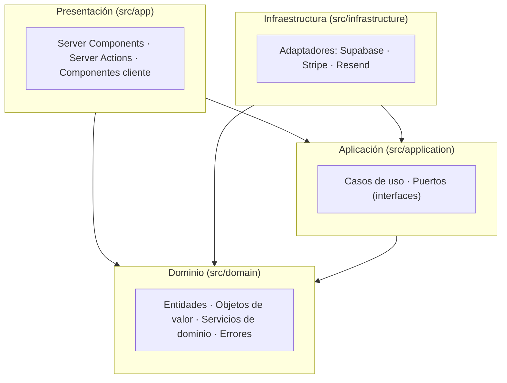
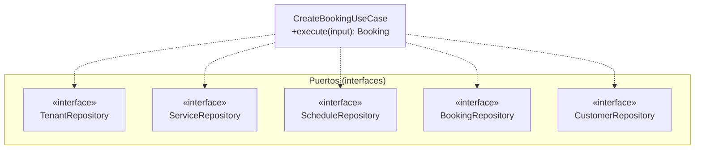
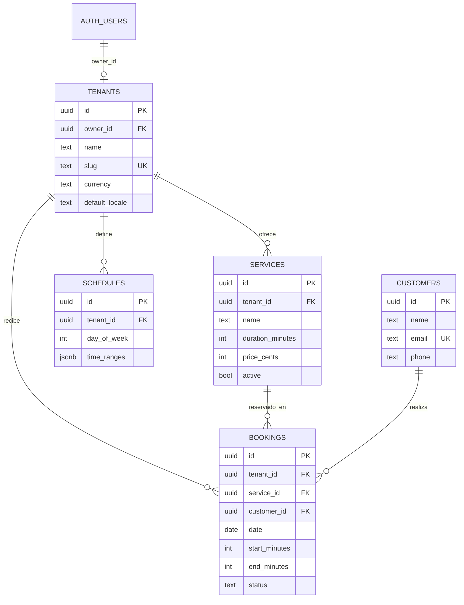

# Capítulo 4. Diseño y Arquitectura

## 4.1. Visión arquitectónica general

El sistema implementa la **Arquitectura Limpia** descrita en el marco conceptual (Capítulo 2), organizando el código en **cuatro capas concéntricas** que respetan una única **regla de dependencias**: el código fuente solo puede depender hacia el interior, nunca hacia el exterior. El dominio, en el centro, no conoce ni el *framework* ni la base de datos; la infraestructura, en el exterior, depende de las abstracciones definidas en las capas internas.



> *Figura 4.1. Capas de la Arquitectura Limpia y regla de dependencias (las flechas apuntan hacia el dominio).*

Esta disposición se corresponde literalmente con la estructura de directorios del repositorio: `src/domain`, `src/application`, `src/infrastructure` y `src/app`.

## 4.2. Capa de dominio

La capa de dominio (`src/domain`) concentra las reglas de negocio y **no contiene ninguna dependencia de *framework***. Se compone de cuatro elementos:

### 4.2.1. Entidades

Las entidades modelan los conceptos centrales con identidad propia: `Tenant`, `Service`, `Booking`, `Customer` y `WeeklySchedule`. Se definen como interfaces de propiedades **inmutables** (`readonly`) —salvo `WeeklySchedule`, modelada como clase—. Por ejemplo, la entidad `Tenant` (`domain/entities/tenant.ts`) agrega no solo datos primitivos, sino también un objeto de valor (`bookingPolicy`), su plan de suscripción (`plan`) y los atributos de integración con la pasarela de pago (`stripeAccountId`, `stripeAccountEnabled`).

### 4.2.2. Objetos de valor

El directorio `domain/value-objects` contiene seis ficheros. **Cinco** de ellos son **objetos de valor** propiamente dichos, que encapsulan un concepto sin identidad y **protegen sus invariantes en el momento de la construcción**: `TimeRange`, `Money`, `Slug`, `BookingPolicy` y `EmailAddress`. El sexto, `BusinessCategory`, es un **tipo enumerado** (unión de literales) sin validación en constructor, empleado para clasificar el tipo de negocio.

El objeto `TimeRange` (`domain/value-objects/time-range.ts`) es representativo del patrón: su constructor rechaza cualquier rango no válido (inicio negativo, fin superior a 1440 minutos o inicio no anterior al fin) lanzando `InvalidTimeRangeError`, de modo que **es imposible instanciar un rango temporal inconsistente**. Además, expone comportamiento de dominio rico —`overlaps`, `contains`, `subtract`, `equals`— que la capa de servicios reutiliza para calcular la disponibilidad.

```typescript
constructor(start: number, end: number) {
  if (start < 0 || end > 1440 || start >= end) {
    throw new InvalidTimeRangeError(start, end)
  }
  this.start = start
  this.end = end
}
```
> *Fragmento 4.1. Protección de invariantes en el constructor de `TimeRange`.*

### 4.2.3. Servicios de dominio

Cuando una operación no pertenece naturalmente a una sola entidad, se modela como **servicio de dominio**: `availability-calculator` (resta de reservas, generación de huecos y verificación de ajuste), `tenant-clock` (operaciones de fecha y hora sensibles a la zona horaria del negocio), `locale-resolver` y `plan-limits` (límites y comisión por plan de suscripción).

### 4.2.4. Errores de dominio

Los errores se modelan como una jerarquía de clases tipadas (`domain/errors/domain-errors.ts`), lo que permite que las capas superiores los distingan y los traduzcan a mensajes para el usuario sin acoplarse a cadenas de texto.

## 4.3. Capa de aplicación

La capa de aplicación (`src/application`) orquesta los casos de uso y define los **puertos** que la infraestructura debe implementar.

- **Casos de uso**: siete clases que coordinan las entidades y los servicios para satisfacer un requisito (por ejemplo, `CreateBookingUseCase`).
- **Puertos**: ocho puertos, definidos como interfaces (`application/ports`), que abstraen la persistencia y los servicios externos (`BookingRepository`, `TenantRepository`, `PaymentService`, `NotificationService`, `StripeConnectService`, etc.).

La **inyección de dependencias** se realiza por **constructor**: un caso de uso recibe sus colaboradores como interfaces, sin conocer su implementación concreta. Así, `CreateBookingUseCase` recibe cinco repositorios (`tenant`, `service`, `schedule`, `booking` y `customer`) y permanece comprobable de forma aislada mediante dobles de prueba.



> *Figura 4.2. El caso de uso depende de los cinco puertos (interfaces), no de implementaciones (inversión de dependencias).*

## 4.4. Capa de infraestructura

La capa de infraestructura (`src/infrastructure`) contiene los **adaptadores** que implementan los puertos de la capa de aplicación:

- **Persistencia**: cinco repositorios sobre Supabase (`SupabaseTenantRepository`, `SupabaseServiceRepository`, `SupabaseScheduleRepository`, `SupabaseBookingRepository`, `SupabaseCustomerRepository`).
- **Pagos**: `StripePaymentService` (`payment-service.ts`) y `StripeConnectServiceImpl` (`stripe-connect-service.ts`).
- **Notificaciones**: `ResendNotificationService` (`resend/`), que implementa el puerto `NotificationService`.

El **ensamblaje de dependencias** se centraliza en una *factory* (`infrastructure/supabase/repositories.ts`), que construye los cinco repositorios a partir de un único cliente de Supabase:

```typescript
export function createRepositories(supabase: SupabaseClient) {
  return {
    tenantRepo: new SupabaseTenantRepository(supabase),
    serviceRepo: new SupabaseServiceRepository(supabase),
    scheduleRepo: new SupabaseScheduleRepository(supabase),
    bookingRepo: new SupabaseBookingRepository(supabase),
    customerRepo: new SupabaseCustomerRepository(supabase),
  }
}
```
> *Fragmento 4.2. Composición de adaptadores en la factory de repositorios.*

## 4.5. Capa de presentación

La capa de presentación (`src/app`) se construye sobre el App Router de Next.js:

- Los **Server Components** renderizan las páginas en el servidor y solicitan datos a través de los casos de uso.
- Los **Server Actions** (`actions.ts`) actúan como **controladores**: reciben la entrada del usuario, invocan la lógica correspondiente y traducen los errores de dominio a mensajes presentables. Conviene precisar una **asimetría real** del proyecto: los *Server Actions* de los flujos **público** (`[slug]/actions.ts`) y de **portal del cliente** (`my/`) invocan los **casos de uso** de la capa de aplicación, mientras que los del **panel de administración** (`bookings`, `schedule`, `services`, `settings`) acceden **directamente a los repositorios** de infraestructura, sin pasar por la capa de aplicación. Esta desviación parcial de la regla de dependencias en la rama de administración se documenta como deuda arquitectónica en el Capítulo 7.
- Los **componentes cliente** (marcados con `'use client'`, como `google-sign-in-button.tsx` o el selector de huecos) se reservan para la interactividad que requiere estado en el navegador.

## 4.6. Gestión del estado

A diferencia de una aplicación SPA tradicional, el sistema **no emplea un almacén de estado global** (tipo Redux o Zustand). El estado se gestiona de forma predominantemente **dirigida por el servidor**:

- El estado de los datos reside en la base de datos y se renderiza en cada petición mediante Server Components.
- Tras una mutación (Server Action), la coherencia de la caché se restablece con `revalidatePath`, evitando datos obsoletos.
- El estado de cliente se limita a la interactividad local de formularios y selectores (mediante los *hooks* de React en componentes cliente).
- La única información persistida en el lado del cliente es la **sesión de autenticación**, almacenada en *cookies* y sincronizada por el interceptor `src/proxy.ts`.

## 4.7. Diseño de la persistencia

La persistencia es **remota**, sobre una base de datos relacional PostgreSQL gestionada por Supabase. El modelo se compone de cinco tablas, evolucionadas a través de diez migraciones versionadas (`supabase/migrations/`).



> *Figura 4.3. Modelo entidad-relación de la persistencia (atributos clave; el diccionario de datos completo se detalla en el Anexo).*

La relación entre `auth.users` y `tenants` es de **uno a cero-o-uno**: cada negocio tiene exactamente un propietario, pero no todo usuario autenticado es propietario (los clientes del portal son usuarios sin negocio).

Aspectos destacables del diseño relacional:

- **Integridad referencial** mediante claves foráneas con borrado en cascada (`on delete cascade`).
- **Restricciones de dominio** en la propia base de datos: `check` sobre `duration_minutes > 0`, `start_minutes < end_minutes` y el conjunto de estados de reserva.
- **Horarios flexibles**: el horario de cada día se almacena como `jsonb` (`time_ranges`), permitiendo varios tramos por día.
- **Indexación** de las consultas frecuentes: `tenants(slug)`, `services(tenant_id)`, `schedules(tenant_id)` y `bookings(tenant_id, date)`, entre otros; además, se definen índices únicos sobre `tenants(owner_id)` y `tenants(stripe_account_id)`.
- **Seguridad a nivel de fila (RLS)** habilitada en las cinco tablas; sus políticas se analizan, junto con sus limitaciones actuales, en el Capítulo 5.

Cabe señalar, en aras del rigor, que el atributo `plan` presente en la entidad de dominio `Tenant` **no dispone todavía de columna en el esquema**: el adaptador de persistencia lo resuelve por defecto a `FREE`. En consecuencia, el modelo de monetización (planes FREE/PRO) está diseñado en el dominio, pero su persistencia y aplicación quedan **pendientes**, y se recogen como línea futura en el Capítulo 7.

## 4.8. Síntesis

El diseño materializa la inversión de dependencias en cada frontera: el dominio define el qué, la aplicación lo orquesta a través de puertos, y la infraestructura aporta el cómo mediante adaptadores intercambiables. Esta separación —verificable en la estructura real del repositorio— es la que habilita la estrategia de pruebas descrita en el Capítulo 6 y sostiene los objetivos de calidad del proyecto, si bien con las desviaciones honestamente señaladas (acceso directo a repositorios en la rama de administración y atributo `plan` no persistido).

---

[◀ Capítulo 3. Análisis de Requisitos y Casos de Uso](03-requisitos-casos-uso.md) · [🏠 Índice](README.md) · [Capítulo 5. Implementación ▶](05-implementacion.md)
