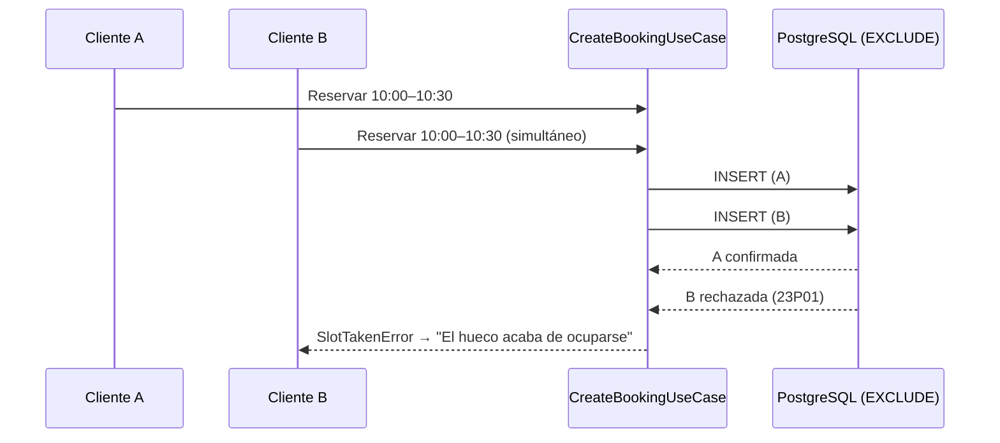
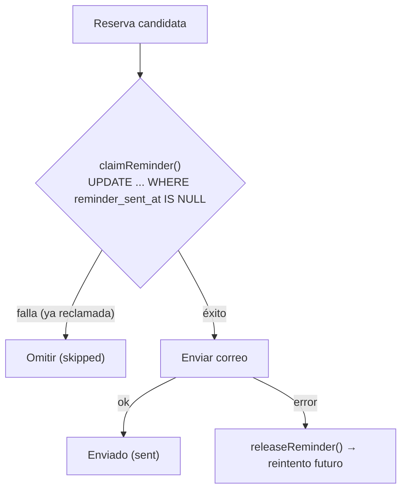

# Capítulo 5. Implementación

## 5.1. Criterio de selección de los aspectos

La implementación completa del sistema abarca un volumen considerable de código (aproximadamente 142 ficheros `.ts`/`.tsx` y unas 9.970 líneas). Documentarla exhaustivamente sería ni viable ni útil; este capítulo se concentra, por tanto, en los **aspectos técnicamente no triviales** —aquellos en los que reside la verdadera dificultad del dominio y que sostienen los objetivos de calidad del Capítulo 1—. Se han seleccionado seis: el **cálculo de disponibilidad**, la **integridad de las reservas ante la concurrencia**, la **gestión sensible a la zona horaria**, la **integración de pagos B2B2C**, la **idempotencia de los recordatorios** y la **seguridad multi-tenant** mediante RLS. Cada uno se ilustra con fragmentos extraídos literalmente del repositorio.

## 5.2. El cálculo de disponibilidad

El núcleo funcional del producto es la respuesta a una pregunta aparentemente simple: *¿qué huecos libres tiene el negocio un día dado?* La disponibilidad no se almacena, sino que se **deriva** de dos fuentes: el horario de apertura del día (uno o varios tramos) menos las reservas ya ocupadas. Esta operación se modela como un **servicio de dominio puro** (`domain/services/availability-calculator.ts`), sin dependencia alguna de la base de datos ni del *framework*.

El algoritmo se apoya en el comportamiento de dominio del objeto de valor `TimeRange` —en particular su método `subtract`, que resta un rango de otro devolviendo de cero a dos rangos resultantes—. La función `subtractBookings` aplica esa resta de forma acumulativa sobre todos los tramos de apertura:

```typescript
export function subtractBookings(
  openingRanges: TimeRange[],
  bookedRanges: TimeRange[]
): TimeRange[] {
  let free = [...openingRanges]
  for (const booked of bookedRanges) {
    free = free.flatMap((range) => range.subtract(booked))
  }
  return free
}
```
> *Fragmento 5.1. Resta acumulativa de reservas sobre los tramos de apertura (`availability-calculator.ts`).*

Sobre el conjunto de rangos libres resultante, una segunda función, `canFitService`, determina si un servicio de duración dada **cabe** en el hueco que el cliente ha seleccionado, reutilizando el método `contains` del objeto de valor:

```typescript
export function canFitService(
  startMinute: number,
  durationMinutes: number,
  freeRanges: TimeRange[]
): boolean {
  const needed = new TimeRange(startMinute, startMinute + durationMinutes)
  return freeRanges.some((free) => free.contains(needed))
}
```
> *Fragmento 5.2. Verificación de ajuste de un servicio en los huecos libres (`availability-calculator.ts`).*

La representación del tiempo como **minutos desde la medianoche** (un entero en `[0, 1440]`, donde 1 440 designa el final de la jornada y, en consecuencia, solo puede actuar como extremo de cierre de un intervalo —el inicio de una reserva queda en `[0, 1440)`—) es una decisión de diseño deliberada: convierte el solapamiento, la resta y la contención de intervalos en aritmética entera trivial, libre de las ambigüedades de las marcas de tiempo absolutas. La conversión desde y hacia el formato `HH:MM` se encapsula en el propio `TimeRange` (`parseHHMM`).

## 5.3. Integridad de las reservas ante la concurrencia

El cálculo de disponibilidad de la sección anterior es **optimista**: comprueba el estado del sistema en un instante dado. Sin embargo, entre el momento en que un cliente consulta la disponibilidad y el momento en que confirma la reserva, **otro cliente puede haber reservado el mismo hueco**. Una validación realizada únicamente en la capa de aplicación sería vulnerable a esta condición de carrera (*race condition*): dos peticiones simultáneas podrían superar ambas la comprobación `canFitService` y persistir reservas solapadas.

La solución adoptada lleva la garantía de integridad a la **única capa verdaderamente autoritativa frente a la concurrencia: la base de datos**. Se define una **restricción de exclusión** (`EXCLUDE`) de PostgreSQL, habilitada por la extensión `btree_gist`, que el motor evalúa de forma atómica en cada inserción (`supabase/migrations/20260422_prevent_booking_overlap.sql`):

```sql
create extension if not exists btree_gist;

alter table public.bookings
  add constraint bookings_no_overlap
  exclude using gist (
    tenant_id with =,
    date with =,
    int4range(start_minutes, end_minutes, '[)') with &&
  )
  where (status <> 'CANCELLED');
```
> *Fragmento 5.3. Restricción de exclusión que impide solapamientos a nivel de base de datos.*

La semántica de la restricción se lee así: el sistema rechazará toda nueva reserva que comparta el mismo `tenant_id` (`with =`) y la misma `date` (`with =`) **y** cuyo intervalo `[start_minutes, end_minutes)` se **solape** (`with &&`) con el de una reserva existente. Tres decisiones merecen comentario:

- El intervalo se modela como `int4range` **semiabierto** `'[)'`: una reserva que termina en el minuto 60 y otra que empieza en el minuto 60 **no** se consideran solapadas, lo que es el comportamiento correcto para citas consecutivas.
- La cláusula `where (status <> 'CANCELLED')` es un **índice parcial**: las reservas canceladas se excluyen de la restricción, de modo que un hueco liberado puede volver a reservarse.
- La combinación de la igualdad (`=`, propia de un índice B-tree) con el solapamiento de rangos (`&&`, propio de un índice GiST) es precisamente lo que exige la extensión `btree_gist`, y constituye una capacidad que un almacén documental no relacional no podría expresar (véase el Capítulo 2).

Cuando esta restricción se viola, PostgreSQL aborta la inserción con el **código de error `23P01`** (*exclusion_violation*). El adaptador de persistencia lo intercepta y lo **traduce a un error de dominio** tipado, `SlotTakenError`, preservando así la regla de que las capas superiores nunca dependen de detalles del motor:

```typescript
if (error) {
  // 23P01 = exclusion_violation (Postgres): the bookings_no_overlap
  // constraint rejected this insert because another booking already
  // occupies an overlapping time range for the same tenant+date.
  if (error.code === '23P01') {
    throw new SlotTakenError()
  }
  throw new Error(`Failed to save booking: ${error.message}`)
}
```
> *Fragmento 5.4. Traducción del error `23P01` de PostgreSQL al error de dominio `SlotTakenError` (`booking-repository.ts`).*

El resultado es una **defensa en dos niveles**: la comprobación optimista en la capa de aplicación ofrece una respuesta inmediata y mensajes de error precisos en el caso común, mientras que la restricción de la base de datos actúa como **garantía pesimista e inviolable** en el caso límite de la concurrencia. La `server action` pública captura `SlotTakenError` y comunica al usuario, con elegancia, que el hueco acaba de ocuparse.



> *Figura 5.1. La restricción de exclusión resuelve la condición de carrera de forma atómica: solo una de dos reservas concurrentes idénticas prospera.*

## 5.4. Gestión sensible a la zona horaria y política de antelación

Un sistema de citas debe razonar sobre el tiempo **en la zona horaria del negocio**, no en la del servidor (que en un entorno *serverless* opera en UTC). El servicio de dominio `tenant-clock` (`domain/services/tenant-clock.ts`) concentra estas operaciones apoyándose en la API estándar `Intl` a través de `toLocaleDateString`/`toLocaleTimeString` con el parámetro `timeZone`:

```typescript
/** Returns minutes from midnight in the tenant's timezone (0–1439) */
export function getTenantLocalMinutes(timezone: string, now?: Date): number {
  const d = now ?? new Date()
  const parts = d
    .toLocaleTimeString('en-GB', {
      timeZone: timezone,
      hour: '2-digit',
      minute: '2-digit',
      hour12: false,
    })
    .split(':')
  return Number(parts[0]) * 60 + Number(parts[1])
}
```
> *Fragmento 5.5. Obtención de la hora local del negocio en minutos desde la medianoche (`tenant-clock.ts`).*

El uso del locale `'en-CA'` para la fecha (`getTenantLocalDate`) es un detalle deliberado: produce el formato `YYYY-MM-DD`, directamente comparable con las fechas que maneja el sistema. Estas funciones sostienen la **política de antelación** del negocio, aplicada en `CreateBookingUseCase`: una **antelación máxima** (`maxAdvanceDays`, no se puede reservar con demasiada anticipación), la prohibición de **fechas pasadas** y, para las reservas del día en curso, una **antelación mínima** (`minAdvanceMinutes`) calculada contra la hora local real del negocio. La firma del caso de uso admite además un parámetro opcional `now?: Date`, lo que permite **inyectar el instante actual** en las pruebas y verificar de forma determinista todas las fronteras temporales.

Se documenta, en aras del rigor, una **limitación conocida**: la derivación del día de la semana a partir de la fecha seleccionada emplea `getUTCDay()`, decisión que puede producir desviaciones para *tenants* en husos alejados de UTC en condiciones límite. Su corrección se recoge entre las líneas futuras del Capítulo 7.

## 5.5. Integración de pagos B2B2C con Stripe Connect

La naturaleza *marketplace* del producto se materializa en el flujo de pago. Cuando un cliente abona un servicio, el dinero debe llegar a la cuenta del **negocio**, no a la de la plataforma, reteniendo esta una **comisión**. Esto se implementa con **Stripe Connect** y dos mecanismos concretos de su API: la **cuenta de destino** (`stripeAccount`) y la **comisión de aplicación** (`application_fee_amount`).

El **alta de la cuenta conectada** del negocio se resuelve con **Stripe Connect Express**: la plataforma crea la cuenta por API (`accounts.create` con `type: 'express'`) y redirige al comercio a un **onboarding alojado por Stripe** (`accountLinks.create`, un enlace de un solo uso) donde este aporta y verifica su identidad y sus datos bancarios; al regresar, el sistema consulta `charges_enabled` para habilitar el cobro. El caso de uso `StripeOnboardingUseCase` orquesta ambas fases —iniciar el *onboarding* y sincronizar el estado—. Este modelo minimiza la fricción del comercio y evita que la plataforma gestione el redireccionamiento OAuth y sus credenciales.

```typescript
const feeAmount = Math.round(
  (request.price.amountCents * request.commissionRateBps) / 10000
)

const session = await getStripe().checkout.sessions.create(
  {
    mode: 'payment',
    /* ... line_items ... */
    payment_intent_data: {
      application_fee_amount: feeAmount,
    },
    metadata: {
      bookingId: request.bookingId,
    },
    success_url: request.successUrl,
    cancel_url: request.cancelUrl,
  },
  { stripeAccount: request.stripeAccountId }
)
```
> *Fragmento 5.6. Creación de la sesión de pago sobre la cuenta conectada del negocio, con comisión de plataforma (`payment-service.ts`).*

La comisión se calcula en **puntos básicos** (`commissionRateBps`): el servicio de dominio `plan-limits` define 500 bps (5 %) para el plan `FREE` y 100 bps (1 %) para el plan `PRO`. El cálculo `amountCents * bps / 10000` con `Math.round` evita el uso de aritmética de coma flotante sobre importes monetarios. El segundo argumento, `{ stripeAccount: request.stripeAccountId }`, instruye a Stripe para que el cargo se efectúe **en nombre de la cuenta conectada** del negocio.

La **confirmación** de la reserva no se produce al crear la sesión, sino de forma **asíncrona y verificada** cuando Stripe notifica el evento `checkout.session.completed` a través de un *webhook*. El manejador **valida criptográficamente la firma** de la notificación antes de actuar, y solo confirma la reserva si esta sigue en estado `PENDING` —una guarda de **idempotencia** que evita confirmaciones o correos duplicados ante reintentos de Stripe—:

```typescript
event = stripe.webhooks.constructEvent(
  body,
  signature,
  process.env.STRIPE_CONNECT_WEBHOOK_SECRET!
)
/* ... */
const booking = await bookingRepo.findById(bookingId)
if (booking && booking.status === BookingStatus.PENDING) {
  await bookingRepo.updateStatus(bookingId, BookingStatus.CONFIRMED)
  await sendConfirmationEmails(supabase, bookingId)
}
```
> *Fragmento 5.7. Confirmación idempotente de la reserva tras verificar la firma del webhook (`webhooks/stripe-connect/route.ts`).*

Conviene matizar que el modelo de planes (`FREE`/`PRO`) está **diseñado en el dominio pero no es funcional todavía**: como se señaló en el Capítulo 4, no existe columna `plan` en el esquema, por lo que todo negocio resuelve a `FREE` y la comisión efectiva es siempre del 5 %. La activación del plan `PRO` figura como trabajo futuro.

## 5.6. Recordatorios idempotentes: el patrón *claim-and-release*

El envío de recordatorios lo dispara una **tarea programada** (`api/cron/send-reminders`) protegida por un secreto en la cabecera `Authorization`. El reto es la **idempotencia**: si el proceso se ejecuta de forma solapada, o falla a mitad de un lote, ninguna reserva debe recibir dos recordatorios. La solución es un patrón **reclamar-y-liberar** (*claim-and-release*) sustentado en una operación atómica de **comparar-e-intercambiar** (*compare-and-swap*) sobre la propia base de datos:

```typescript
async claimReminder(id: string, sentAt: Date): Promise<boolean> {
  const { data, error } = await this.supabase
    .from('bookings')
    .update({ reminder_sent_at: sentAt.toISOString() })
    .eq('id', id)
    .is('reminder_sent_at', null) // solo si nadie lo ha reclamado aún
    .select('id')

  if (error) throw new Error(`Failed to claim reminder: ${error.message}`)
  return (data ?? []).length > 0
}
```
> *Fragmento 5.8. Reclamación atómica del envío mediante un* update *condicionado (`booking-repository.ts`).*

La cláusula `.is('reminder_sent_at', null)` es la clave: el `UPDATE` solo afecta a la fila si el recordatorio **aún no ha sido reclamado**, y devuelve si la operación tuvo éxito. El planificador procede entonces así: para cada reserva candidata, intenta **reclamarla**; si la reclamación falla, otra ejecución ya la atendió y la **omite**; si la reclamación tiene éxito pero el envío del correo **falla**, **libera** la reclamación (`releaseReminder`) para que un ciclo posterior la reintente. De este modo se satisface el requisito no funcional RNF-8 sin necesidad de un sistema de colas externo.



> *Figura 5.2. Patrón claim-and-release: la reclamación atómica garantiza, como máximo, un recordatorio por reserva.*

## 5.7. Multi-tenancy y seguridad a nivel de fila (RLS)

El aislamiento entre negocios se apoya en la **seguridad a nivel de fila** (*Row Level Security*) de PostgreSQL, habilitada en las cinco tablas. El patrón general consiste en conceder al **propietario** acceso completo a las filas de su negocio, comprobando la pertenencia contra `auth.uid()`:

```sql
create policy "Owner full access" on public.services
  for all using (
    tenant_id in (select id from public.tenants where owner_id = auth.uid())
  );
```
> *Fragmento 5.9. Política RLS de acceso del propietario a sus propios servicios (`20260220221052_initial_schema.sql`).*

Este patrón se aplica de forma robusta a `tenants`, `services` y `schedules`. Las tablas `bookings` y `customers`, en cambio, presentaban originalmente políticas **deliberadamente permisivas** —lectura e inserción públicas sin restricción— como concesión pragmática para habilitar el flujo de reserva **anónimo** (un cliente final sin sesión debe poder crear una reserva y su registro de cliente). Su efecto colateral era una **fuga real de información personal**: dado que la clave anónima de Supabase es pública por diseño, cualquiera podía volcar los datos de clientes y reservas de todos los negocios a través de la API REST.

Esta brecha se ha **cerrado** con la migración `20260710_tighten_rls_pii.sql`, que retira la lectura e inserción públicas y **acota el acceso a propietario y titular**:

```sql
drop policy if exists "Public read"   on public.customers;
drop policy if exists "Public insert" on public.customers;

-- El cliente lee su propio registro; el dueño, los clientes con reserva en su negocio.
create policy "Customer read own" on public.customers for select
  using (auth_user_id = auth.uid());
-- (ídem, mutatis mutandis, para bookings)
```
> *Fragmento 5.10. Endurecimiento de la RLS que cierra la exposición de PII (`20260710_tighten_rls_pii.sql`).*

Para que el flujo anónimo siga funcionando bajo una RLS restrictiva, las tres rutas de servidor de confianza que dependían del acceso público —el cálculo de **disponibilidad**, la **creación de reserva** y el **auto-enlace del cliente** en el portal— se reenrutan al cliente de ***service-role***, que opera al margen de la RLS pero emite únicamente consultas parametrizadas y acotadas. Es un **compromiso consciente de defensa en profundidad**: se renuncia a la RLS solo en código de servidor auditado, mientras la aplicación sigue filtrando por `tenant_id` y la restricción de solapamiento permanece vigente en la base de datos. Con ello, la garantía de aislamiento pasa a residir **también en la capa declarativa de la base de datos**, y no solo en la aplicación. La evaluación completa de este y de los demás controles de seguridad —cabeceras, contraseñas fuertes, limitación de tasa, validación del entorno y registro de eventos— figura en el [Anexo E](09-anexos.md).

## 5.8. Internacionalización

El sistema ofrece soporte bilingüe (es-ES / en-US) en dos planos. En el **panel de administración**, la traducción se resuelve en el servidor (`infrastructure/i18n/`), evitando enviar funciones como propiedades a los componentes cliente —una restricción real de los React Server Components que motivó una corrección específica durante el desarrollo—. En las **comunicaciones por correo** (`infrastructure/resend/`), la plantilla, su traducción y el formateo de fechas se seleccionan según el locale del negocio, manteniendo el envío detrás del puerto `NotificationService` de la capa de aplicación.

Un tercer plano —los **correos de autenticación** (confirmación de cuenta, restablecimiento de contraseña)— presentaba una restricción propia: las plantillas de Supabase Auth son de un solo idioma. Se resolvió con un ***Send Email Hook***: Supabase delega el envío en un endpoint propio (`api/auth/send-email`) que **verifica la firma HMAC** (Standard Webhooks) de la petición, resuelve el idioma del usuario —guardado en sus metadatos al registrarse— y renderiza el correo con la misma infraestructura i18n, enviándolo por Resend desde el dominio verificado. De este modo, **todo el correo del sistema** —transaccional y de cuenta— es bilingüe y coherente en remitente.

## 5.9. Panel de operador de plataforma (*superadmin*)

Más allá del panel de cada negocio, la plataforma incorpora un **panel de operador** (`/superadmin`) para administrar a sus negocios cliente: consultar métricas de actividad y **activar o desactivar** cada negocio. Su diseño ilustra dos decisiones de ingeniería representativas.

El **acceso** se restringe por una lista blanca de correos (`SUPERADMIN_EMAILS`): un guard de servidor (`requireSuperadmin`) comprueba el correo de la sesión y responde `notFound()` (404) a quien no figure en ella —sin revelar siquiera que la ruta existe— y falla *en cerrado* si la lista está vacía. Solo **tras** superar ese guard se emplea el rol de servicio para leer datos *cross-tenant*, saltando la RLS de forma controlada; nunca antes. Las métricas por negocio —reservas por estado, clientes distintos, volumen confirmado (separando pago *online* y presencial) y comisión de plataforma, calculada **solo sobre el volumen *online*** por coherencia con el cobro real vía Stripe Connect— se **agregan en un caso de uso** de la capa de aplicación a partir de filas leídas de forma **paginada**, manteniendo la lógica de negocio testeable con dobles de prueba.

La **desactivación** de un negocio bloquea sus reservas públicas —comprobado en los tres puntos del flujo: página pública, cálculo de disponibilidad y creación de reserva— mientras le permite seguir accediendo a su propio panel. El interruptor es una columna `active` cuya **inmutabilidad para el propio dueño** se garantiza en la base de datos con un *trigger* `BEFORE UPDATE`. La primera aproximación —revocar el privilegio `UPDATE(active)` al rol `authenticated`— resultó **inefectiva**: en PostgreSQL un privilegio `UPDATE` a nivel de tabla domina sobre un `REVOKE` de columna, de modo que el dueño habría podido reactivarse por su cuenta. El *trigger*, que rechaza el cambio salvo para el rol de servicio, cierra el hueco sin enumerar columnas. Este hallazgo surgió de una **revisión adversarial del diseño** previa a la implementación —un ejemplo del valor de someter las decisiones de seguridad a escrutinio explícito antes de escribir el código (OM-2)—.

## 5.10. Síntesis

Los aspectos detallados comparten un mismo principio rector: **situar cada garantía en la capa adecuada**. La lógica de disponibilidad reside en el dominio puro y comprobable; la integridad ante la concurrencia se delega en la capa autoritativa de la base de datos mediante una restricción de exclusión; la confirmación del pago se ancla en un *webhook* firmado e idempotente; la idempotencia de los recordatorios se logra con una operación atómica de comparar-e-intercambiar; y el control del operador sobre sus negocios cliente combina un *guard* de autorización en el servidor, la inmutabilidad del estado en un *trigger* de base de datos y la agregación de métricas en un caso de uso testeable. El capítulo ha documentado asimismo el **endurecimiento de la RLS** sobre `bookings`/`customers` —cuya permisividad original, una fuga real de PII, se ha subsanado (Anexo E)— y ha expuesto, sin omitirla, la limitación más relevante que aún persiste —la inoperatividad del modelo de planes—, que se retoma como trabajo futuro. La estrategia de pruebas que verifica todos estos comportamientos se describe en el Capítulo 6.

---

[◀ Capítulo 4. Diseño y Arquitectura](04-diseno-arquitectura.md) · [🏠 Índice](README.md) · [Capítulo 6. Estrategia de Pruebas y Control de Calidad ▶](06-pruebas-calidad.md)
