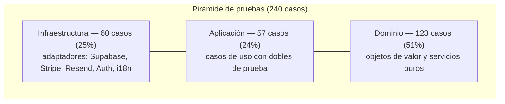

# Capítulo 6. Estrategia de Pruebas y Control de Calidad

## 6.1. Filosofía: TDD y la pirámide de pruebas

La calidad del software es, según se argumentó en el Capítulo 1, el eje vertebrador del Trabajo de Fin de Máster. Su materialización más tangible es la **batería de pruebas automatizadas**, concebida bajo dos principios complementarios:

- **Desarrollo guiado por pruebas (*Test-Driven Development*)**: en las capas de dominio y aplicación, la prueba precede a la implementación, de modo que cada regla de negocio nace acompañada de su especificación ejecutable.
- **La pirámide de pruebas**: la mayor densidad de pruebas se concentra en la base —pruebas unitarias rápidas y deterministas sobre el dominio—, disminuyendo a medida que se asciende hacia la infraestructura, más costosa de verificar. Esta forma no es casual: es la consecuencia directa de una Arquitectura Limpia que aísla la lógica de negocio de sus dependencias.

## 6.2. Marco y configuración

El marco de pruebas es **Vitest 4** (`vitest run` para la ejecución única; `vitest` en modo vigilancia). La configuración integra `vite-tsconfig-paths` —que resuelve el alias de módulos `@/*` también en las pruebas— y `@vitejs/plugin-react`. La elección frente a Jest se justificó en el Capítulo 2 por su compatibilidad nativa con ESM y TypeScript. El proyecto define además un script de cobertura (`test:coverage`) con un **umbral que opera como puerta de calidad automatizada** (§6.7).

## 6.3. Distribución de la batería de pruebas

La suite comprende **240 casos de prueba distribuidos en 32 ficheros**. Su reparto por capas evidencia la pirámide descrita:

| Capa | Ficheros de prueba | Casos | Peso |
|------|--------------------|-------|------|
| **Dominio** | 11 | 123 | 51 % |
| **Aplicación** (casos de uso) | 7 | 57 | 24 % |
| **Infraestructura** | 14 | 60 | 25 % |
| **Total** | **32** | **240** | **100 %** |

> *Tabla 6.1. Distribución de la batería de pruebas por capa arquitectónica.*

El dato relevante no es solo el volumen, sino su **forma**: el 75 % de las pruebas se concentra en las capas de dominio y aplicación —las que albergan las reglas de negocio—, y el dominio por sí solo es la capa más ejercitada (51 %), lo que constituye una evidencia objetiva de que la arquitectura ha cumplido su propósito de hacer la lógica crítica verificable de forma aislada y barata.

> *Figura 6.1. La batería de pruebas adopta la forma de pirámide: base ancha en el dominio puro.*

## 6.4. Pruebas de la capa de dominio

El dominio, al carecer de dependencias externas, se presta a una verificación **exhaustiva y determinista**. Los objetos de valor concentran buena parte del esfuerzo: `TimeRange` reúne por sí solo 27 casos que ejercitan sus invariantes (rechazo de rangos inválidos) y su comportamiento (`overlaps`, `contains`, `subtract`). Las pruebas del `availability-calculator` (15 casos) verifican el algoritmo de resta de reservas frente a casos representativos —reserva en el centro de un tramo que lo parte en dos, reservas que dejan el horario completo, encadenamientos—, que son precisamente los escenarios en los que un cálculo ingenuo fallaría.

## 6.5. Pruebas de la capa de aplicación

Los casos de uso se prueban **de forma aislada**, sustituyendo sus colaboradores (repositorios y servicios) por **dobles de prueba** (*test doubles*) que implementan los mismos puertos. Esto es posible, sin artificios, gracias a la **inyección de dependencias por constructor** descrita en el Capítulo 4: `CreateBookingUseCase` recibe cinco repositorios como interfaces y, en las pruebas, se le inyectan implementaciones en memoria.

Dos decisiones de diseño habilitan un determinismo total:

- La inyección del instante actual (`now?: Date`) permite fijar «la hora del sistema» en cada prueba, verificando las fronteras de la **política de antelación** (reserva demasiado pronto, demasiado tarde, en el pasado) sin depender del reloj real.
- La separación de responsabilidades hace que cada una de las **excepciones de dominio** (`TenantNotFoundError`, `BusinessClosedError`, `ServiceDoesNotFitError`, etc.) sea un caso de prueba dirigido y reproducible.

Los 13 casos de `create-booking.test.ts` cubren así tanto el flujo satisfactorio como el conjunto de ramas de error del caso de uso más complejo del sistema.

## 6.6. Pruebas de la capa de infraestructura

En la infraestructura, las pruebas verifican la **correcta traducción entre el mundo externo y el dominio**, no las dependencias de terceros en sí. Son representativos dos casos:

- En `payment-service.test.ts`, se comprueba que el **cálculo de la comisión** en puntos básicos (`amountCents * bps / 10000`) es correcto y que la sesión de pago se construye con los parámetros esperados de Stripe Connect.
- En `booking-repository.test.ts`, se verifica que el código de error `23P01` de PostgreSQL se traduce efectivamente a `SlotTakenError`, garantizando que la frontera de integridad descrita en el Capítulo 5 se comporta como se espera.

## 6.7. Análisis estático, integración continua y cobertura

Más allá de las pruebas dinámicas, el control de calidad se apoya en **dos líneas de análisis estático**: el **compilador de TypeScript en modo estricto** (`tsc`), que erradica clases enteras de errores en tiempo de compilación, y **ESLint** con la configuración de Next.js (`eslint-config-next`), ambos sin errores.

Estas comprobaciones no son solo locales: un flujo de **integración continua** (GitHub Actions, `.github/workflows/ci.yml`) las institucionaliza como **puerta de calidad**, ejecutando en cada *push* y *pull request* la secuencia `lint → tsc --noEmit → vitest --coverage → build`. La **cobertura actúa como puerta**: el umbral configurado (85 % de sentencias, funciones y líneas; 75 % de ramas) hace **fallar la construcción** si no se alcanza, medido sobre las capas de dominio, aplicación e infraestructura.

La capa de **presentación** (rutas, *Server Actions* y componentes), cuya cobertura por líneas sería engañosa al medir dobles del *framework* más que lógica propia, se valida mediante **pruebas *end-to-end* automatizadas con Playwright** (`e2e/`, script `test:e2e`), que recorren el flujo real de reserva contra el despliegue. Con ello, la calidad **practicada** se convierte en calidad **medida y forzada por la herramienta**.

## 6.8. Síntesis

La estrategia de pruebas no es un añadido posterior, sino el reflejo directo de la arquitectura: una pirámide de 240 casos cuya base ancha (75 % en dominio y aplicación) solo es posible porque la lógica de negocio se diseñó desacoplada y comprobable. El análisis estático estricto, la cobertura acotada por **umbral**, las pruebas **E2E automatizadas** y su ejecución en **integración continua** completan un marco de calidad no solo *practicado*, sino *medido y forzado por la herramienta*.

---

[◀ Capítulo 5. Implementación](05-implementacion.md) · [🏠 Índice](README.md) · [Capítulo 7. Conclusiones y Líneas Futuras ▶](07-conclusiones.md)
